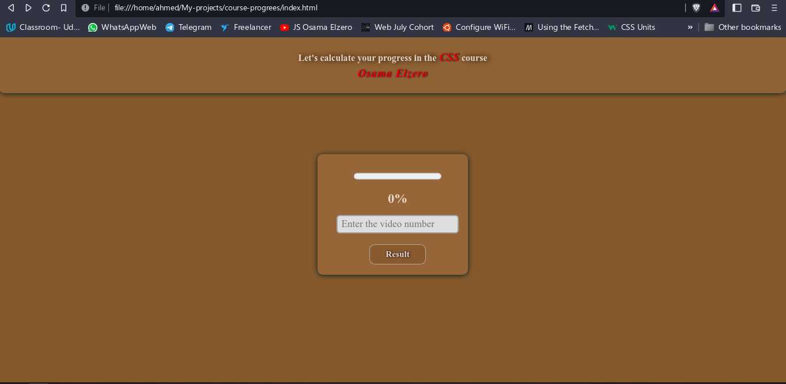
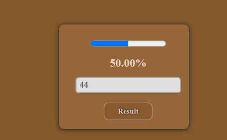
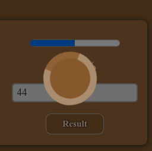
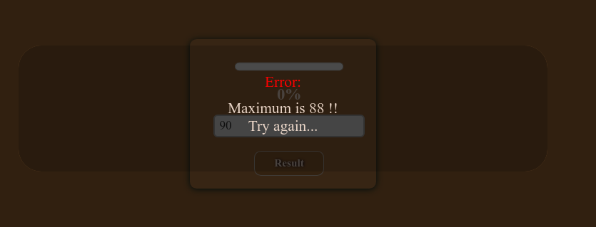

# Course Calculator:
## css-course-calc
- This project is about a simple calculator for students who are studying ``` Osama Elzero CSS Course ```
- It help you getting know how much you have finished the course using precentage ``` % ```

- You will be motivated for sure when you know how much you have finished.

---
## Screenshots:
- The webpage:

- Trying the APP:

- Loader screen:

- Error-message:

- When trying to exceed 88 "The Number of videos in playlist"
---
## Usage: 

- Clone the project from:
``` 
git clone https://github.com/Ahmed-Osama2022/css-course-calc.git 
```
---
### This was made by Ahmed Osama
---

## Link to Osama Elzero CSS Course:

```
https://www.youtube.com/playlist?list=PLDoPjvoNmBAzjsz06gkzlSrlev53MGIKe
```
